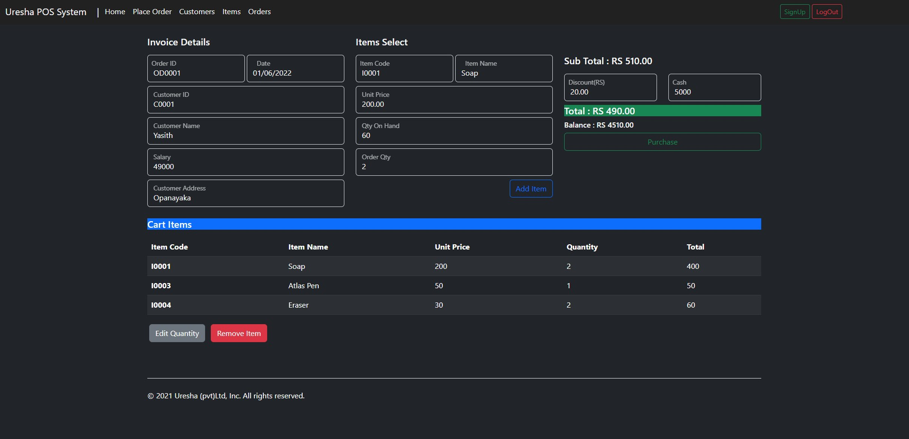

# Uresha POS System

This projects was created to lean and practice frameworks.
This project used Bootstrap Framework.

Mockup URL      : https://www.figma.com/file/AvktTrhUvEgMuR1nec5XBl/Untitled?node-id=0%3A1

SiteMap URL     : https://www.gloomaps.com/GpqkVTJMKq

WireFrame URL   : https://wireframe.cc/a4cFNG

## Features

- Place a Order
- Manage Item
- Manage Customers
- Manage Orders

## Authors

- [@Yasith C Bandara](https://www.github.com/YasithCB)

